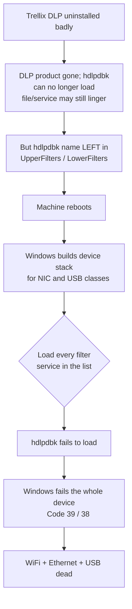
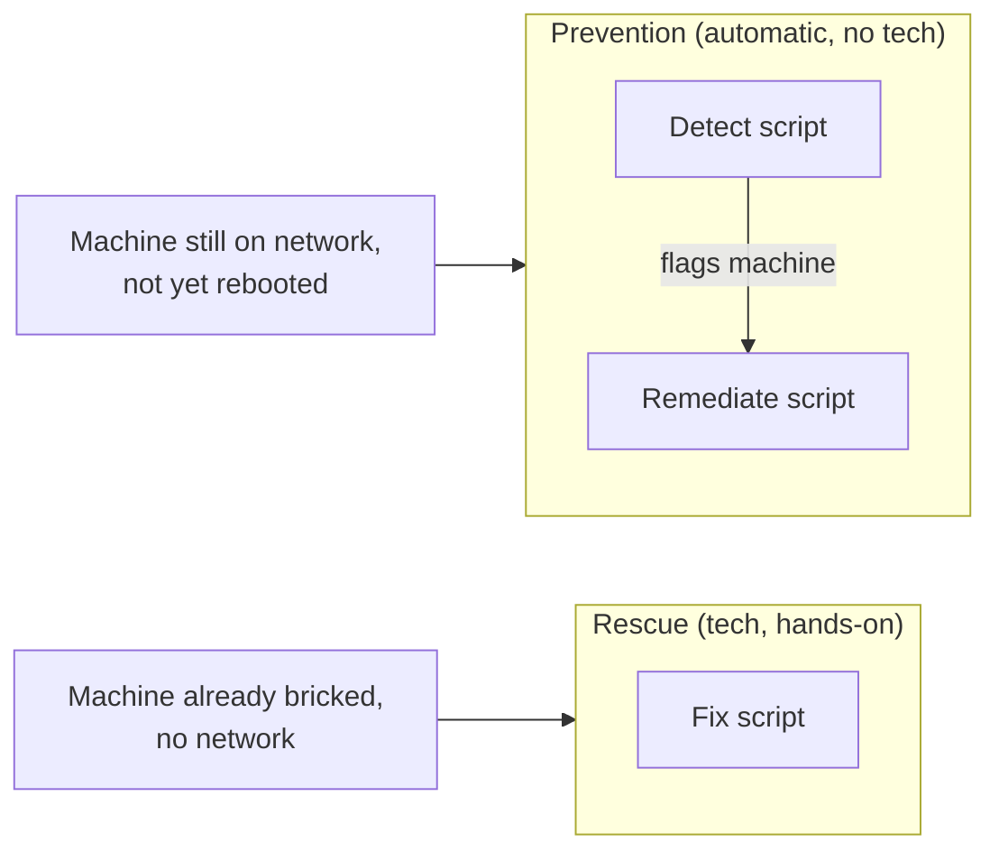
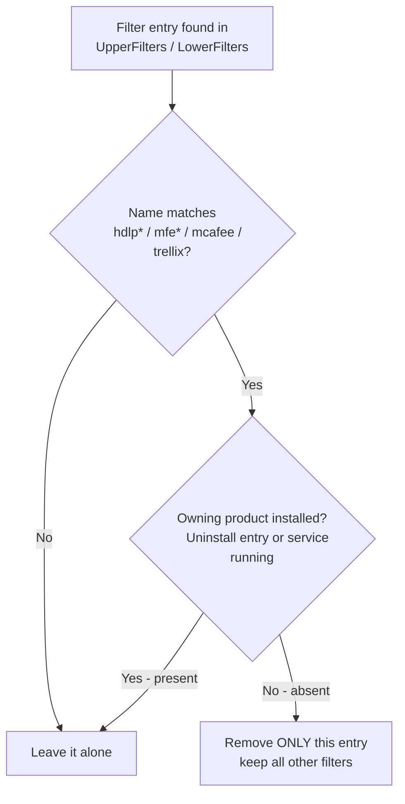

# Trellix DLP Orphaned Filter Cleanup

Tools to detect and remove **orphaned Trellix/McAfee DLP device filter drivers** that
block WiFi, Ethernet, and USB after a failed Trellix DLP uninstall.

---

## Table of contents

- [The problem (in plain terms)](#the-problem-in-plain-terms)
- [The problem (technical)](#the-problem-technical)
- [What these tools do](#what-these-tools-do)
- [The scripts](#the-scripts)
- [How the PR (Intune) pair works](#how-the-pr-intune-pair-works)
- [The safety logic (why this is safe to run everywhere)](#the-safety-logic-why-this-is-safe-to-run-everywhere)
- [Usage](#usage)
- [Backup & rollback](#backup--rollback)
- [Logging](#logging)
- [Limitations](#limitations)
- [Credits](#credits)

---

## The problem (in plain terms)

When Trellix DLP is installed, it leaves a "note" in Windows that says: *"before you
start the WiFi / Ethernet / USB devices, also load my driver first."*

- **Trellix installed** → the note points to a driver that exists → everything works.
- **Trellix uninstalled badly** → the note is left behind, but the driver it points to
  is **gone** → on the next reboot Windows tries to load a driver that no longer exists,
  gives up, and **shuts off WiFi, Ethernet, and USB.** The machine is effectively bricked.

The fix is simply to **remove the leftover note** — but *only* the dead ones, and *only*
on machines where Trellix is genuinely gone.

## The problem (technical)

To enforce Device Control, Trellix DLP (formerly McAfee DLP) installs a kernel-mode
**class filter driver**, `hdlpdbk.sys` (the *DLP Device Blocking Filter Driver*). It
registers itself in the `UpperFilters` / `LowerFilters` values under device **class** keys:

```
HKLM\SYSTEM\CurrentControlSet\Control\Class\{ClassGUID}
```

Relevant class GUIDs:

| Device class | Class GUID |
|---|---|
| Network adapters (WiFi + Ethernet) | `{4D36E972-E325-11CE-BFC1-08002BE10318}` |
| USB controllers | `{36FC9E60-C465-11CF-8056-444553540000}` |

These filter values are `REG_MULTI_SZ` (a list of **service names**, not file paths). At
boot, Windows builds each device's driver stack and loads every filter service listed. If
the DLP uninstall left the `hdlpdbk` **name** in the filter list but the driver can no
longer load (service de-registered, or its real `ImagePath` file gone), the load fails and
Windows fails the **entire device** — typically **Code 39** (and the related **Code 38**
documented in Trellix KB93017). Because DLP filters each device *class* separately, NIC and
USB all go down together.

> **Important nuance (why detection is product-based):** the driver file is **not** a
> reliable signal. Uninstallers routinely leave `hdlpdbk.sys` behind (often a stray copy in
> `System32\drivers`) even though the DLP product is gone and the device is blocked. So
> "the `.sys` exists" does **not** mean Trellix is healthy. These tools therefore decide on
> the one unambiguous signal: **is the product that owns the driver actually installed?**



## What these tools do

The core action in every script is identical: **find a Trellix/McAfee filter entry, confirm
the product that owns it is no longer installed, and remove only that orphaned entry** —
then reboot so Windows rebuilds a clean device stack.

There are two delivery paths:



- **PR pair (prevention):** runs automatically via Intune Remediations to catch and defuse
  a machine **before** it bricks (while it still has a network).
- **Fix script (rescue):** a technician runs it by hand on a machine that is **already**
  bricked (Intune can't reach it — no network).

## The scripts

| Script | Role | Runs as | Notifies user | Reboot |
|---|---|---|---|---|
| `Detect-TrellixOrphanedFilters.ps1` | Intune **detection** (read-only check) | SYSTEM | No | No |
| `Remediate-TrellixOrphanedFilters.ps1` | Intune **remediation** (the fixer) | SYSTEM | **Yes** (5-min warning) | Yes, 5 min |
| `Fix-TrellixOrphanedFilters.ps1` | **Tech** on-device rescue | Admin | No (tech is present) | Yes, 30 s |
| `Get-TrellixFilterDiagnostic.ps1` | **Read-only** diagnostic (collects state) | Any (elevated best) | No | No |

## How the PR (Intune) pair works

The PR is two scripts working as a **checker** and a **fixer**.

### 1. The checker — `Detect-TrellixOrphanedFilters.ps1`

Intune runs this on a schedule on every machine. It asks one question and **changes
nothing**:

> *Is there a Trellix/McAfee filter entry whose owning product is no longer installed?*

- **No** → reports compliant (exit `0`) → nothing happens. (Healthy installs land here — the
  owning product is present, so the entry is not flagged.)
- **Yes** → reports non-compliant (exit `1`) → Intune triggers the fixer.

### 2. The fixer — `Remediate-TrellixOrphanedFilters.ps1`

Runs **only on flagged machines**. It backs up, removes the dead entry, logs, warns the
user, and reboots.


**Why it won't loop or false-fire in Intune:** if the owning product is still installed,
detection returns compliant and the remediation never runs — so it can't show as
*recurring* or *failed*. It only acts when the product is gone, and once the orphaned entry
is removed there's nothing left to flag on the next check.

## The safety logic (why this is safe to run everywhere)

Every script removes a filter entry **only if both conditions are true**:

1. **Name match** — the entry is a Trellix/McAfee driver (`hdlp*`, `mfe*`, `mcafee`, `trellix`).
2. **Owner absent** — the **product that owns that driver is not installed** (no Uninstall
   entry and no matching service running).

Driver files on disk are deliberately **not** part of the decision (they linger after
uninstall). Both guards are required. Only the orphaned string is pruned; any other
legitimate filter in the same `REG_MULTI_SZ` value is preserved.



Driver ownership map:

| Driver | Owned by | Cleared when |
|---|---|---|
| `hdlpdbk`, `hdlpflt` | DLP | DLP not installed |
| `mfehidk` (shared) | DLP **or** ENS | **neither** DLP nor ENS installed |
| other `hdlp*`/`mfe*` | any McAfee/Trellix product | no McAfee/Trellix product installed |

This is what protects:

- **Healthy machines** — the owning product is installed → left alone (even if a device
  looks odd, repair is the product owner's job, not ours).
- **Shared drivers** — `mfehidk` stays put as long as ENS (or DLP) is installed.
- **Stray driver files** — a leftover `hdlpdbk.sys` no longer fools the check, because the
  decision is product presence, not file-on-disk.
- **Non-Trellix filters** — never match the name pattern → never touched.

## Usage

### Tech rescue (already-bricked machine)

Run elevated, locally. Always dry-run first:

```powershell
# 1) Dry run - report only, change nothing
powershell -ExecutionPolicy Bypass -File ".\Fix-TrellixOrphanedFilters.ps1" -WhatIf

# 2) Apply the fix and reboot (30 s) to complete it
powershell -ExecutionPolicy Bypass -File ".\Fix-TrellixOrphanedFilters.ps1"

# Apply but do not reboot
powershell -ExecutionPolicy Bypass -File ".\Fix-TrellixOrphanedFilters.ps1" -NoReboot
```

> Note: if the **USB controller class** is among the bricked devices, USB storage may not
> mount — keep a local copy of the script on the machine or use another transfer path.

### Diagnostic (collect machine state, read-only)

Use on an affected (or healthy) machine to capture the full picture for analysis:

```powershell
powershell -ExecutionPolicy Bypass -File ".\Get-TrellixFilterDiagnostic.ps1"

# Or tee a copy to a file for sharing
powershell -ExecutionPolicy Bypass -File ".\Get-TrellixFilterDiagnostic.ps1" |
    Tee-Object "$env:WINDIR\Temp\TrellixDiag-$env:COMPUTERNAME.txt"
```

### Intune Remediations (prevention)

In the Intune portal, create a Remediation and upload the pair:

- **Detection script:** `Detect-TrellixOrphanedFilters.ps1`
- **Remediation script:** `Remediate-TrellixOrphanedFilters.ps1`
- **Run as:** System
- **Run in 64-bit PowerShell:** Yes
- **Schedule:** frequent (e.g. hourly) to catch machines before their next reboot.

## Backup & rollback

Before changing anything, the modifying scripts (`Fix-` and `Remediate-`) export every
affected registry key to a timestamped `.reg` file:

```
%WINDIR%\Temp\TrellixFilterFix-<timestamp>.backup.reg
%WINDIR%\Temp\TrellixFilterRemediate-<timestamp>.backup.reg
```

The remediation script **aborts if the backup fails**, so a change is never made without a
rollback point. To reverse a change:

```powershell
reg import "C:\Windows\Temp\TrellixFilterRemediate-<timestamp>.backup.reg"
# then reboot
```

## Logging

Every script writes a timestamped log for each entry it inspects, keeps (with the reason the
owner was found present), or removes (with the reason it was judged orphaned). Each line also
records the forensic driver detail (`svcKey=…; imagePathFile=…`) even though it isn't the
deciding factor:

```
%WINDIR%\Temp\TrellixFilterDetect-<timestamp>.log
%WINDIR%\Temp\TrellixFilterFix-<timestamp>.log
%WINDIR%\Temp\TrellixFilterRemediate-<timestamp>.log
```

## Limitations

- The **PR pair only helps while a machine still has a network.** Once a machine has
  bricked, Intune cannot reach it — use the `Fix-` script by hand on those.
- This is therefore a **race**: run the detection frequently so orphaned entries are
  defused before the user's next reboot.
- Confirm the owner patterns match your environment's installed-program names. Run
  `Get-TrellixFilterDiagnostic.ps1` (or `Fix- -WhatIf`) on one real affected machine and one
  healthy machine, and review the logs to confirm the decision is correct before going wide.
- If a machine's **owning product is still installed but the device is broken**, these tools
  intentionally leave it alone (that's the product owner's repair, and it avoids Intune
  loops). Flag those to the DLP team rather than force-clearing.

## References

- [hdlpdbk.sys — McAfee/Trellix DLP Device Blocking Filter Driver](http://windowfdb.com/q.php?q=hdlpdbk-sys-c-windows-system32-drivers)
- [Trellix KB93017 — Some hardware devices stop functioning after DLP is installed and rebooted (Code 38)](https://kcm.trellix.com/corporate/index?page=content&id=KB93017&locale=en_US)
- [How McAfee DLP Endpoint and Device Control work (Trellix docs)](https://docs.trellix.com/bundle/data-loss-prevention-11.1.x-product-guide/page/GUID-916E5282-2B84-4150-A8CD-5F6F82238F81.html)
- [McAfee Community — "DLP issue driver not installed Hdlpdbk removable storage"](https://community.mcafee.com/t5/Data-Loss-Prevention-DLP/DLP-issue-driver-not-installed-Hdlpdbk-removable-storage/td-p/649284)
- [Implementing McAfee Device Control Security (PDF)](https://www.e-spincorp.com/pdf/product/Mcafee/Implementing_McAfee_DLPe_Device_Control.pdf)
- [DEVPKEY_Device_UpperFilters (Microsoft Learn)](https://learn.microsoft.com/en-us/windows-hardware/drivers/install/devpkey-device-upperfilters)
- [Trellix Data Loss Prevention product page](https://www.trellix.com/products/dlp/)

## Credits

- **Author:** Joshua Walderbach
- **Contributors:** Brandon Villines, Corey Heflin, TJ Walton
- **Thanks:** Sanket Rana, Christopher Lamphere (testing & log research)
