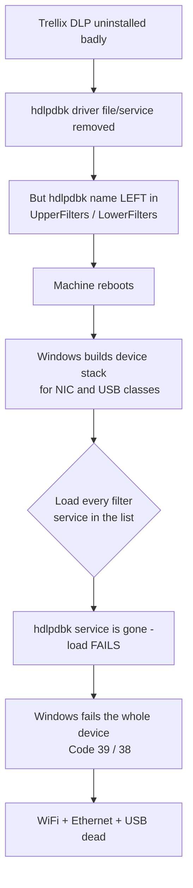
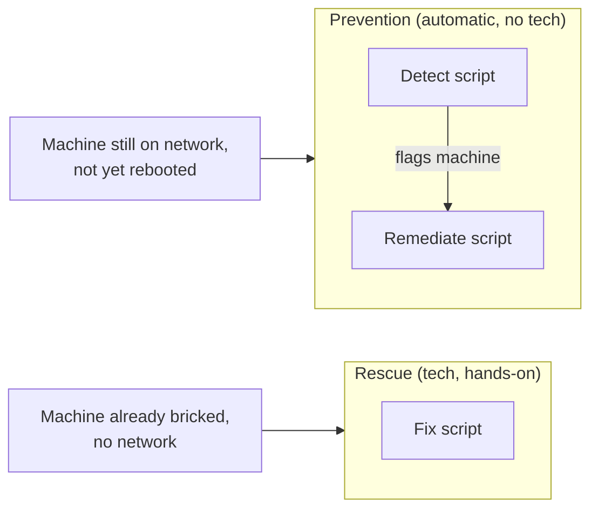
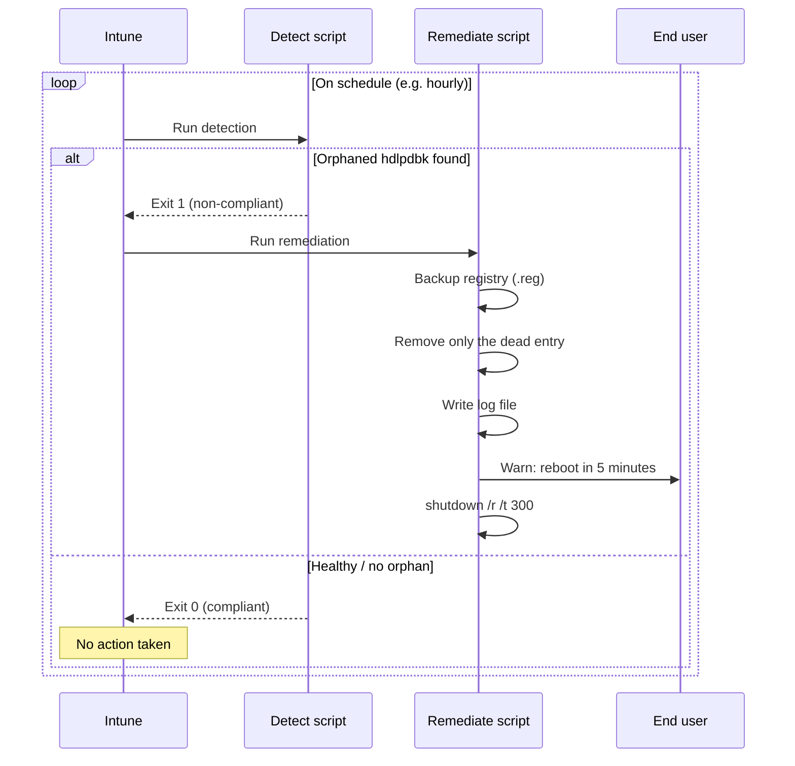
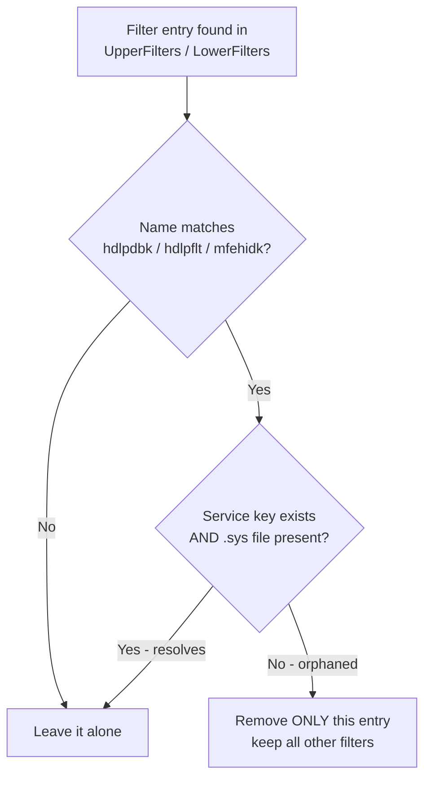

# Trellix DLP Orphaned Filter Cleanup

Tools to detect and remove **orphaned Trellix/McAfee DLP device filter drivers** that
block WiFi, Ethernet, and USB after a failed Trellix DLP uninstall.

---

## Table of contents

- [The problem (in plain terms)](#the-problem-in-plain-terms)
- [The problem (technical)](#the-problem-technical)
- [What these tools do](#what-these-tools-do)
- [The scripts](#the-scripts)
- [How the PR (Intune) pair works](#how-the-pr-intune-pair-works)
- [The safety logic (why this is safe to run everywhere)](#the-safety-logic-why-this-is-safe-to-run-everywhere)
- [Usage](#usage)
- [Backup & rollback](#backup--rollback)
- [Logging](#logging)
- [Limitations](#limitations)
- [Credits](#credits)

---

## The problem (in plain terms)

When Trellix DLP is installed, it leaves a "note" in Windows that says: *"before you
start the WiFi / Ethernet / USB devices, also load my driver first."*

- **Trellix installed** → the note points to a driver that exists → everything works.
- **Trellix uninstalled badly** → the note is left behind, but the driver it points to
  is **gone** → on the next reboot Windows tries to load a driver that no longer exists,
  gives up, and **shuts off WiFi, Ethernet, and USB.** The machine is effectively bricked.

The fix is simply to **remove the leftover note** — but *only* the dead ones, and *only*
on machines where Trellix is genuinely gone.

## The problem (technical)

To enforce Device Control, Trellix DLP (formerly McAfee DLP) installs a kernel-mode
**class filter driver**, `hdlpdbk.sys` (the *DLP Device Blocking Filter Driver*). It
registers itself in the `UpperFilters` / `LowerFilters` values under device **class** keys:

```
HKLM\SYSTEM\CurrentControlSet\Control\Class\{ClassGUID}
```

Relevant class GUIDs:

| Device class | Class GUID |
|---|---|
| Network adapters (WiFi + Ethernet) | `{4D36E972-E325-11CE-BFC1-08002BE10318}` |
| USB controllers | `{36FC9E60-C465-11CF-8056-444553540000}` |

These filter values are `REG_MULTI_SZ` (a list of **service names**, not file paths). At
boot, Windows builds each device's driver stack and loads every filter service listed. If
the DLP uninstall removed the `hdlpdbk` service/driver file but left its **name** in the
filter list, the load fails and Windows fails the **entire device** — typically **Code 39**
(and the related **Code 38** documented in Trellix KB93017). Because DLP filters each
device *class* separately, NIC and USB all go down together.



## What these tools do

The core action in every script is identical: **find a leftover `hdlpdbk` filter entry,
confirm the driver is actually gone, and remove only that dead entry** — then reboot so
Windows rebuilds a clean device stack.

There are two delivery paths:



- **PR pair (prevention):** runs automatically via Intune Remediations to catch and defuse
  a machine **before** it bricks (while it still has a network).
- **Fix script (rescue):** a technician runs it by hand on a machine that is **already**
  bricked (Intune can't reach it — no network).

## The scripts

| Script | Role | Runs as | Notifies user | Reboot |
|---|---|---|---|---|
| `Detect-TrellixOrphanedFilters.ps1` | Intune **detection** (read-only check) | SYSTEM | No | No |
| `Remediate-TrellixOrphanedFilters.ps1` | Intune **remediation** (the fixer) | SYSTEM | **Yes** (5-min warning) | Yes, 5 min |
| `Fix-TrellixOrphanedFilters.ps1` | **Tech** on-device rescue | Admin | No (tech is present) | Yes, 30 s |

## How the PR (Intune) pair works

The PR is two scripts working as a **checker** and a **fixer**.

### 1. The checker — `Detect-TrellixOrphanedFilters.ps1`

Intune runs this on a schedule on every machine. It asks one question and **changes
nothing**:

> *Is there a leftover `hdlpdbk` filter entry pointing to a driver that's already gone?*

- **No** → reports compliant (exit `0`) → nothing happens. (Healthy Trellix installs land
  here — the entry resolves to a real driver, so it's not flagged.)
- **Yes** → reports non-compliant (exit `1`) → Intune triggers the fixer.

### 2. The fixer — `Remediate-TrellixOrphanedFilters.ps1`

Runs **only on flagged machines**. It backs up, removes the dead entry, logs, warns the
user, and reboots.



**Why it won't loop or false-fire in Intune:** if Trellix is still installed, the entry
resolves to a real driver, detection returns compliant, and the remediation never runs —
so it can't show as *recurring* or *failed*. It only acts on genuinely broken machines,
and once fixed they report compliant on the next check.

## The safety logic (why this is safe to run everywhere)

Every script removes a filter entry **only if both conditions are true**:

1. **Name match** — the entry is a known DLP driver (`hdlpdbk`, `hdlpflt`, `mfehidk`).
2. **Orphaned** — the named service is missing, **or** its driver `.sys` file is missing.

Both guards are required. Only the dead string is pruned; any other legitimate filter in
the same `REG_MULTI_SZ` value is preserved.



This is what protects:

- **Healthy Trellix machines** — `hdlpdbk` resolves to a real driver → left alone.
- **Shared drivers** — e.g. `mfehidk`, often owned by Trellix ENS rather than DLP; if ENS
  still owns it the driver resolves → left alone.
- **Non-Trellix filters** — never match the name list → never touched.

## Usage

### Tech rescue (already-bricked machine)

Run elevated, locally. Always dry-run first:

```powershell
# 1) Dry run - report only, change nothing
powershell -ExecutionPolicy Bypass -File ".\Fix-TrellixOrphanedFilters.ps1" -WhatIf

# 2) Apply the fix and reboot (30 s) to complete it
powershell -ExecutionPolicy Bypass -File ".\Fix-TrellixOrphanedFilters.ps1"

# Apply but do not reboot
powershell -ExecutionPolicy Bypass -File ".\Fix-TrellixOrphanedFilters.ps1" -NoReboot
```

> Note: if the **USB controller class** is among the bricked devices, USB storage may not
> mount — keep a local copy of the script on the machine or use another transfer path.

### Intune Remediations (prevention)

In the Intune portal, create a Remediation and upload the pair:

- **Detection script:** `Detect-TrellixOrphanedFilters.ps1`
- **Remediation script:** `Remediate-TrellixOrphanedFilters.ps1`
- **Run as:** System
- **Run in 64-bit PowerShell:** Yes
- **Schedule:** frequent (e.g. hourly) to catch machines before their next reboot.

## Backup & rollback

Before changing anything, the modifying scripts (`Fix-` and `Remediate-`) export every
affected registry key to a timestamped `.reg` file:

```
%WINDIR%\Temp\TrellixFilterFix-<timestamp>.backup.reg
%WINDIR%\Temp\TrellixFilterRemediate-<timestamp>.backup.reg
```

The remediation script **aborts if the backup fails**, so a change is never made without a
rollback point. To reverse a change:

```powershell
reg import "C:\Windows\Temp\TrellixFilterRemediate-<timestamp>.backup.reg"
# then reboot
```

## Logging

Every script writes a timestamped log for each entry it inspects, keeps (with the reason it
resolved), or removes (with the reason it was judged orphaned):

```
%WINDIR%\Temp\TrellixFilterDetect-<timestamp>.log
%WINDIR%\Temp\TrellixFilterFix-<timestamp>.log
%WINDIR%\Temp\TrellixFilterRemediate-<timestamp>.log
```

## Limitations

- The **PR pair only helps while a machine still has a network.** Once a machine has
  bricked, Intune cannot reach it — use the `Fix-` script by hand on those.
- This is therefore a **race**: run the detection frequently so orphaned entries are
  defused before the user's next reboot.
- Confirm the target driver names match your environment. Run `Fix- -WhatIf` on one real
  affected machine and review the log to verify `hdlpdbk` is the entry being found.

## Credits

- **Author:** Joshua Walderbach
- **Contributors:** Brandon Villines, Corey Heflin, TJ Walton
- **Thanks:** Sanket Rana, Christopher Lamphere (testing & log research)
