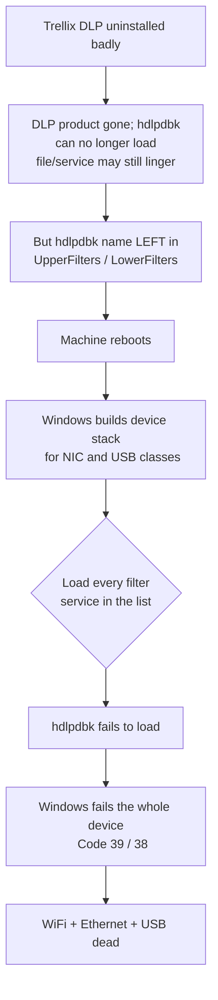
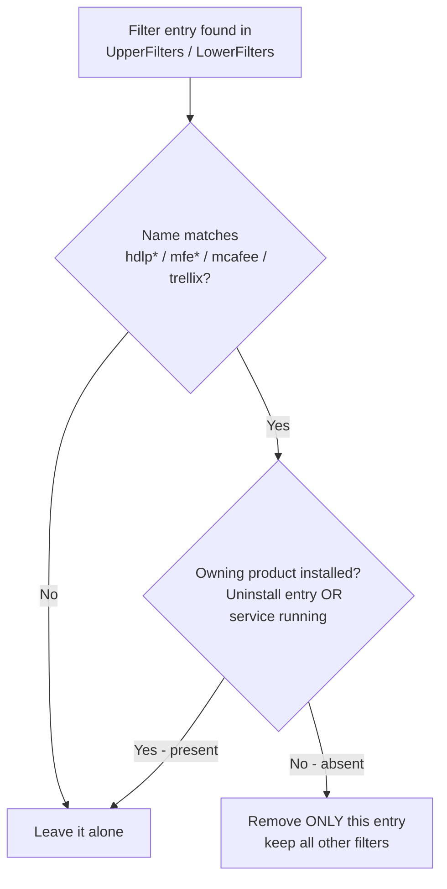
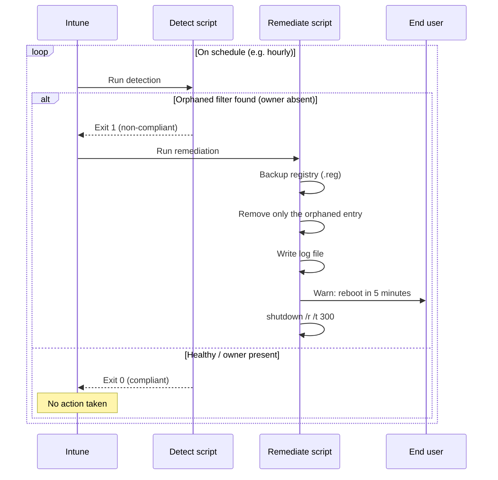

# Technical Reference

In-depth explanation of the Trellix DLP orphaned-filter problem and how these scripts
detect and remediate it. For quick start and usage, see [README.md](README.md).

## Table of contents

- [The brick mechanism](#the-brick-mechanism)
- [Why the driver file is not a reliable signal](#why-the-driver-file-is-not-a-reliable-signal)
- [The decision model: product ownership](#the-decision-model-product-ownership)
- [Driver ownership map](#driver-ownership-map)
- [How the PR (Intune) pair works](#how-the-pr-intune-pair-works)
- [Why it won't loop or false-fire in Intune](#why-it-wont-loop-or-false-fire-in-intune)
- [Scope decisions and edge cases](#scope-decisions-and-edge-cases)
- [Logging](#logging)
- [Limitations](#limitations)
- [References](#references)

---

## The brick mechanism

To enforce Device Control, Trellix DLP (formerly McAfee DLP) installs a kernel-mode
**class filter driver**, `hdlpdbk.sys` (the *DLP Device Blocking Filter Driver*). It
registers itself in the `UpperFilters` / `LowerFilters` values under device **class** keys:

```
HKLM\SYSTEM\CurrentControlSet\Control\Class\{ClassGUID}
```

Relevant class GUIDs:

| Device class | Class GUID |
|---|---|
| Network adapters (WiFi + Ethernet) | `{4D36E972-E325-11CE-BFC1-08002BE10318}` |
| USB controllers | `{36FC9E60-C465-11CF-8056-444553540000}` |

These filter values are `REG_MULTI_SZ` — a list of **service names**, not file paths. At
boot, Windows builds each device's driver stack and loads every filter service listed. If
the DLP uninstall left the `hdlpdbk` **name** in the filter list but the driver can no
longer load (service de-registered, or its real `ImagePath` file gone), the load fails and
Windows fails the **entire device** — typically **Code 39** (and the related **Code 38**
documented in Trellix KB93017). Because DLP filters each device *class* separately, NIC and
USB all go down together.



## Why the driver file is not a reliable signal

An early version of these scripts treated "is `hdlpdbk.sys` on disk?" as proof Trellix was
healthy. **That is wrong.** Uninstallers routinely leave the driver file behind — often a
stray copy in `System32\drivers` — because it is locked/in use at uninstall time. So a
machine can have:

- `hdlpdbk.sys` still present on disk ✅, **and**
- the DLP product fully uninstalled and the device blocked ❌.

Relying on the file would *miss* exactly the machines that need clearing. The scripts
therefore decide on the one unambiguous signal: **is the product that owns the driver
actually installed?** The file/service state is still collected and logged for forensics,
but it does not drive the decision.

## The decision model: product ownership

A filter entry is removed **only if both** conditions hold:

1. **Name match** — the entry is a Trellix/McAfee driver (`hdlp*`, `mfe*`, `mcafee`,
   `trellix`).
2. **Owner absent** — the **product that owns that driver is not installed**.

"Installed" is determined by checking **two independent sources** and counting the product
present if *either* matches:

- **Installed Programs** — the Uninstall registry keys, checked in **both** the 64-bit and
  32-bit (`WOW6432Node`) hives, matched by product display name.
- **Running services** — all services currently in the `Running` state, matched by their
  binary path.



Only the orphaned string is pruned; any other legitimate filter in the same `REG_MULTI_SZ`
value is preserved.

## Driver ownership map

Different drivers belong to different products, so the check is per-driver:

| Driver | Owned by | Cleared when |
|---|---|---|
| `hdlpdbk`, `hdlpflt` | DLP | DLP not installed |
| `mfehidk` (shared) | DLP **or** ENS | **neither** DLP nor ENS installed |
| other `hdlp*` / `mfe*` | any McAfee/Trellix product | no McAfee/Trellix product installed |

This is what makes it safe across mixed environments:

- **Healthy machines** — the owning product is installed → entry left alone.
- **Shared drivers** — `mfehidk` stays put as long as ENS (or DLP) is installed, so removing
  DLP never breaks ENS.
- **Stray driver files** — a leftover `hdlpdbk.sys` no longer fools the check.
- **Non-Trellix filters** — never match the name pattern → never touched.

The owner patterns are defined at the top of each script in `$DriverOwnerPatterns` (with a
`$DefaultOwnerPattern` fallback) and can be tuned to your environment's product names.

## How the PR (Intune) pair works

The pair is a **checker** and a **fixer**.

- **`Detect-`** runs on a schedule and changes nothing. If it finds an orphan (name-matched,
  owner absent) it exits `1` (non-compliant) and Intune triggers the fixer; otherwise it
  exits `0` (compliant).
- **`Remediate-`** runs only on flagged machines. It snapshots installed products/services,
  re-applies the same decision, backs up the affected keys, removes only the orphaned
  entries, logs everything, warns the user, and reboots in 5 minutes.



## Why it won't loop or false-fire in Intune

If the owning product is still installed, detection returns compliant and the remediation
never runs — so it can't show as *recurring* or *failed*. It only acts when the product is
gone, and once the orphaned entry is removed there's nothing left to flag on the next check.
Nothing re-creates the entry, because the product that would add it is no longer present.

## Scope decisions and edge cases

- **Product installed but device still broken.** The scripts intentionally **leave it alone**
  (and log it). That is the product owner's repair to make, and acting on it would risk
  fighting a live product and creating Intune "recurring" loops. Flag those machines to the
  DLP team rather than force-clearing. (If you want to override this, add a device-error-state
  trigger — ask and it can be added.)
- **Mid-uninstall.** If a machine is caught between the product being removed and the next
  reboot, the owner check sees the product gone and clears the orphan — which is the correct
  outcome, since that machine was heading for the brick anyway.
- **Broad scan.** Both Class keys and device-instance (`Enum`) keys are scanned. The
  name-match + owner-absent guard makes the broad scan safe.

## Logging

Every script writes a timestamped log per run under `%WINDIR%\Temp\`:

```
%WINDIR%\Temp\TrellixFilterDetect-<timestamp>.log
%WINDIR%\Temp\TrellixFilterFix-<timestamp>.log
%WINDIR%\Temp\TrellixFilterRemediate-<timestamp>.log
```

Each entry it inspects is logged as **keep** (owner present) or **ORPHAN** (owner absent),
along with the forensic driver detail (`svcKey=…; imagePathFile=…`) even though that detail
is not the deciding factor. Backups are written alongside as `*.backup.reg`.

## Limitations

- The **PR pair only helps while a machine still has a network.** Once a machine has bricked,
  Intune cannot reach it — use the `Fix-` script by hand on those.
- This is therefore a **race**: run detection frequently so orphaned entries are defused
  before the user's next reboot.
- Owner detection matches the product's **display name**. Confirm the patterns match your
  environment with `Get-TrellixFilterDiagnostic.ps1` (or `Fix- -WhatIf`) on a real affected
  machine and a healthy one before going wide.

## References

- [hdlpdbk.sys — McAfee/Trellix DLP Device Blocking Filter Driver](http://windowfdb.com/q.php?q=hdlpdbk-sys-c-windows-system32-drivers)
- [Trellix KB93017 — Some hardware devices stop functioning after DLP is installed and rebooted (Code 38)](https://kcm.trellix.com/corporate/index?page=content&id=KB93017&locale=en_US)
- [How McAfee DLP Endpoint and Device Control work (Trellix docs)](https://docs.trellix.com/bundle/data-loss-prevention-11.1.x-product-guide/page/GUID-916E5282-2B84-4150-A8CD-5F6F82238F81.html)
- [McAfee Community — "DLP issue driver not installed Hdlpdbk removable storage"](https://community.mcafee.com/t5/Data-Loss-Prevention-DLP/DLP-issue-driver-not-installed-Hdlpdbk-removable-storage/td-p/649284)
- [Implementing McAfee Device Control Security (PDF)](https://www.e-spincorp.com/pdf/product/Mcafee/Implementing_McAfee_DLPe_Device_Control.pdf)
- [DEVPKEY_Device_UpperFilters (Microsoft Learn)](https://learn.microsoft.com/en-us/windows-hardware/drivers/install/devpkey-device-upperfilters)
- [Trellix Data Loss Prevention product page](https://www.trellix.com/products/dlp/)
